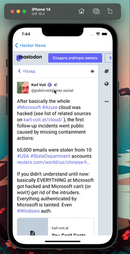

# HackerNews

## What did I create

HackerNews is a Hacker News reader. I used the Hacker News API to get hold of the latest articles that are trending on Hacker News.

## What did I learn

* How to work with SwiftUI, Lists and the Identifical Protocol
* How to use a Navigation View to navigate between the List and a detail view
* Learn advanced State management using the Observer Design Pattern
* Learn to incorporate a UIKit component into SwiftUI by using WebKit to display web pages in your app

